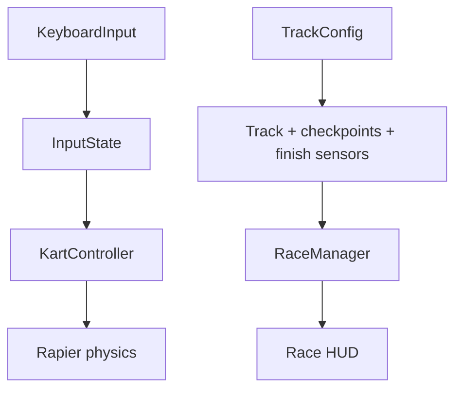
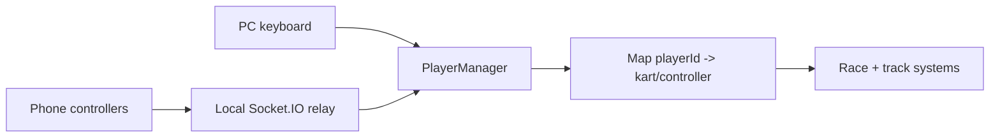
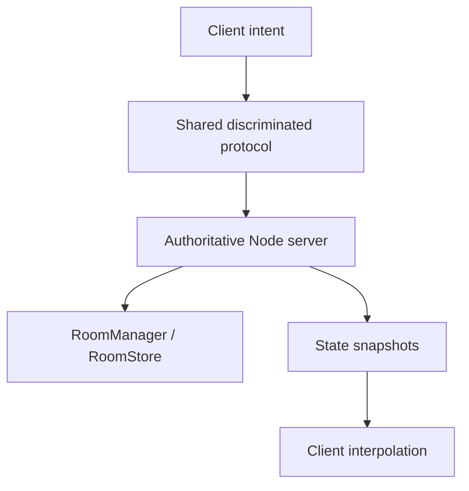

# Rush Local Architecture

## Current local flow

The PC browser owns rendering, physics, race timing, and authoritative local state. Fast-changing values stay in refs or game-loop objects; Zustand carries UI snapshots.

## Input abstraction

All future sources produce the same normalized `InputState`. Keyboard and the OpenWii adapter should never be imported by `KartController`. This keeps local phone input and future online input interchangeable.

## Local multiplayer target

`PlayerManager` is keyed by player ID rather than hardcoded player variables. The current committed baseline predates the phone relay restoration, so this repository phase adds the shared contracts and item/player foundations without pretending phone connectivity is active.

## Online foundation

The first server implementation should keep rooms in memory behind a `RoomStore` interface. Redis, PostgreSQL, authentication, and matchmaking ranking remain future concerns.

## State ownership

- `InputState`: player intent only.
- `KartController`: local movement simulation.
- `RaceManager`: laps, checkpoints, timing, and results.
- `PlayerManager`: player identity, selected kart, connection, and item ownership.
- `TrackConfig`: data for layouts, spawns, checkpoints, and item points.
- Server snapshots: future authoritative state; clients must not submit position, speed, lap, or ranking.
